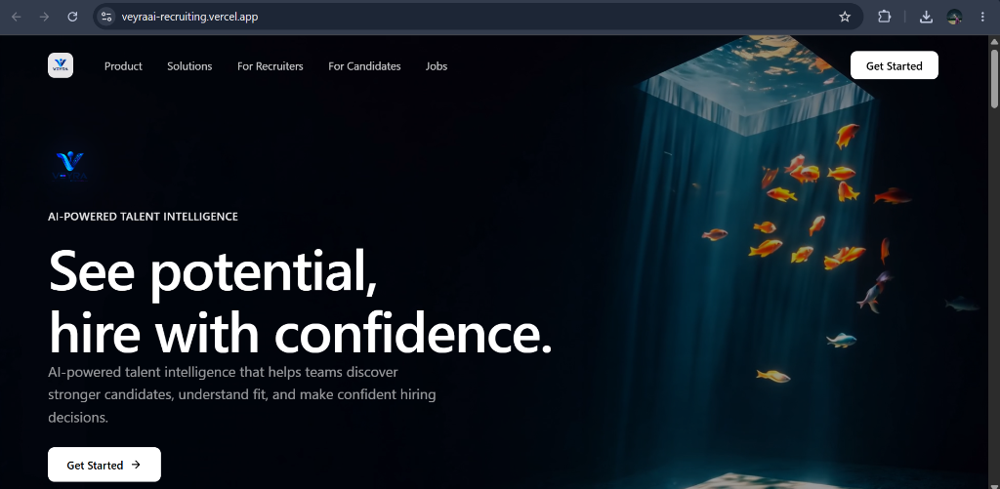
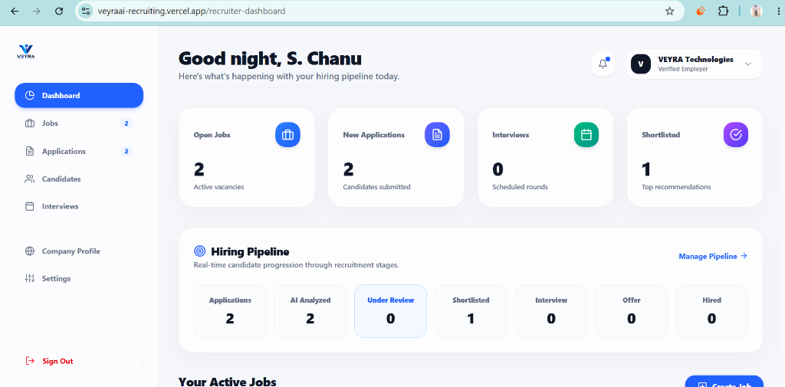
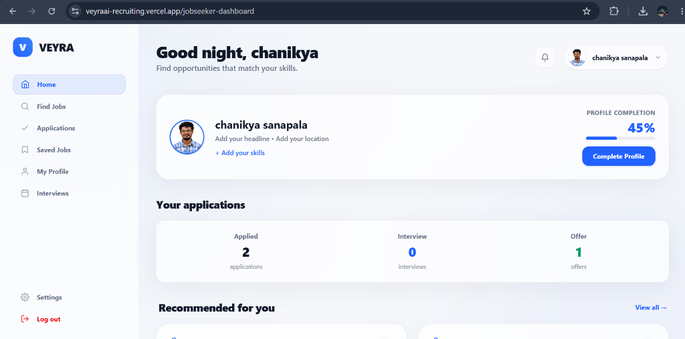

# ⚡ VEYRA — Future of AI Recruitment & Talent Intelligence

> **Veyra** is a hyper-premium, AI-native talent intelligence platform designed to eliminate hiring bias, automate candidate evaluation, and accelerate recruitment cycles from months to days. By replacing outdated keyword-matching ATS filters with multi-dimensional semantic scoring and autonomous AI video/audio interviews, Veyra connects top-tier candidates with recruiters seamlessly.

---

## 🌟 Visual Showcase & Dashboard Previews

### 1. Cinematic Landing Page

*High-contrast, immersive landing page introducing Veyra's AI-driven recruitment engine, live matching metrics, and interactive candidate/recruiter entry points.*

---

### 2. Recruiter Command Center

*Centralized recruiting dashboard equipped with real-time candidate analytics, job posting management, candidate match scoring, submittal funnels, and interview schedules.*

---

### 3. Jobseeker / Candidate Portal

*Personalized candidate workspace for discovering high-fit job opportunities, tracking active applications, reviewing AI match scores, and boosting interview preparedness.*

---

## ✨ Core Features & Platform Capabilities

### 🎯 AI Resume Matchmaker
- **Semantic Overlap Scoring**: Goes beyond naive keyword counting by analyzing core competencies, project deliverables, and domain expertise.
- **Match Score Breakdown**: Displays clear match percentages and skill alignment breakdowns for both candidates and recruiters.
- **Automated Resume Parsing**: Seamlessly extracts work history, education, certifications, and technical skills from uploaded resumes.

### 🤖 Autonomous AI Interview Engine
- **Dynamic Question Generation**: Generates contextual technical and soft-skill interview questions tailored to specific job requirements.
- **Audio & Video Response Recording**: Supports real-time speech response capture, playback, and automated transcripts.
- **Fair & Objective Scoring**: Evaluates candidate responses based on relevance, technical accuracy, and communication clarity—minimizing human bias.

### ⚡ Recruiter Command Center
- **Job Lifecycle Management**: Create, edit, publish, and close job listings with customized skill tags and deadline scheduling.
- **Pipeline Progression**: Drag-and-drop or status-based applicant tracking (`Applied`, `Shortlisted`, `Interviewing`, `Offered`, `Rejected`).
- **Submittal & Placement Analytics**: Built-in visual charts (via Recharts) tracking candidate volume, conversion rates, and time-to-hire metrics.

### 🚀 Jobseeker Career Portal
- **Smart Job Search**: Filter open positions by domain, experience level, salary range, and custom keyword queries.
- **One-Click Application**: Streamlined application workflow auto-populating candidate profile and latest resume metrics.
- **Skill Workout & Prep**: Built-in practice modules to hone interview skills and maintain activity streaks.

---

## 🏗️ Project Architecture & Repository Structure

Veyra is built as a structured monorepo comprising three specialized modules:

```text
CHANIX-FUTURE-OF-AI-RECRUITMENT/
├── frontend/                  # Next.js 15 + React 19 Client Web Application
│   ├── src/
│   │   ├── app/               # App Router pages (Dashboard, Landingpage, Login, Signup, etc.)
│   │   ├── components/        # UI Components & Dashboard Widgets
│   │   └── utils/             # Client-side API helpers & state management
│   ├── public/                # Static assets & icons
│   └── package.json
├── backend/                   # Node.js + Express REST API Engine
│   ├── src/
│   │   ├── config/            # Database connection & JWT configurations
│   │   ├── controllers/       # Business logic (Auth, Jobs, Applications, Profiles, Interviews)
│   │   ├── models/            # Mongoose Schemas (User, Job, Profile, Application, Interview)
│   │   ├── routes/            # Express API endpoint definitions
│   │   └── utils/             # Email services, scheduler, and file helpers
│   ├── cleanup_users.js       # Database maintenance utility script
│   └── package.json
├── ai/                        # Python AI Evaluation Engine
│   ├── app.py                 # Flask / FastAPI service for NLP & question generation
│   ├── interview.py           # AI Interview scoring logic
│   └── requirements.txt       # Python dependencies
├── VEYRA-DESIGN/              # Comprehensive UI/UX Design System & Specification Specs
└── assets/
    └── images/                # Dashboard previews & screenshots
```

---

## 🧰 Technology Stack

### **Frontend**
- **Framework**: Next.js 15 (App Router), React 19
- **Styling**: Tailwind CSS v4, Glassmorphism UI design, Custom CSS Tokens
- **Components & Visuals**: Lucide React Icons, Emotion, Material-UI Icons, Recharts
- **Interactive FX**: Vanta.js, Three.js 3D dynamic canvas backgrounds

### **Backend**
- **Runtime**: Node.js & Express.js
- **Database**: MongoDB (Mongoose ORM)
- **Authentication**: JSON Web Tokens (JWT) & bcryptjs password hashing
- **Mailing**: Nodemailer / SMTP integration for verification and notifications

### **AI Engine**
- **Language**: Python 3.9+
- **AI / NLP**: OpenAI API / Custom NLP scoring algorithms for candidate evaluation and question generation

---

## 🛠️ Getting Started & Local Setup

### Prerequisites
Ensure you have the following installed locally:
- **Node.js**: v18.x or higher
- **npm**: v9.x or higher
- **Python**: v3.9+
- **MongoDB**: Local instance running on `mongodb://localhost:27017` or a MongoDB Atlas URI

---

### Step 1: Clone the Repository

```bash
git clone https://github.com/Chanikya-Sanapala/Veyra.git
cd Veyra
```

---

### Step 2: Configure & Start Backend API

```bash
cd backend
npm install
```

Create a `.env` file inside the `backend/` directory:

```env
PORT=5000
MONGODB_URI=mongodb://localhost:27017/smart-engine
JWT_SECRET=your_super_secret_jwt_key_here
EMAIL_USER=your_email@gmail.com
EMAIL_PASS=your_gmail_app_password
```

Start the backend server:

```bash
npm run dev
```

---

### Step 3: Configure & Start Frontend Web App

Open a new terminal window:

```bash
cd frontend
npm install
```

Create a `.env.local` file inside the `frontend/` directory (if custom API URL is needed):

```env
NEXT_PUBLIC_API_URL=http://localhost:5000/api
```

Start the Next.js development server:

```bash
npm run dev
```

Navigate to `http://localhost:3000` in your web browser.

---

### Step 4: Configure & Start AI Engine

Open a new terminal window:

```bash
cd ai
python -m venv venv
# On Windows:
venv\Scripts\activate
# On macOS/Linux:
source venv/bin/activate

pip install -r requirements.txt
```

Create a `.env` file in the `ai/` directory:

```env
OPENAI_API_KEY=your_openai_api_key_here
PORT=5001
```

Run the AI server:

```bash
python app.py
```

---

## 📡 API Overview

| Module | Method | Endpoint | Description |
| :--- | :--- | :--- | :--- |
| **Auth** | `POST` | `/api/auth/signup` | Register new recruiter or jobseeker account |
| **Auth** | `POST` | `/api/auth/login` | Authenticate user and issue JWT |
| **Jobs** | `GET` | `/api/jobs` | Retrieve active job postings |
| **Jobs** | `POST` | `/api/jobs` | Create a new job posting (Recruiter) |
| **Applications** | `POST` | `/api/applications` | Submit application with resume match scoring |
| **Applications** | `GET` | `/api/applications/jobseeker` | Fetch candidate application history |
| **Interviews** | `POST` | `/api/interviews/schedule` | Schedule AI interview session for applicant |
| **Interviews** | `GET` | `/api/interviews/:token` | Fetch interactive AI interview session details |

---

## 🔒 Security & Privacy Practices

- **Zero Plaintext Credentials**: All sensitive keys, secrets, and database credentials are excluded from source control using strict `.gitignore` rules.
- **JWT Protection**: Secured, state-less token authentication across protected candidate and recruiter routes.
- **Environment Isolation**: Configured with `.env.example` templates for frictionless developer onboarding.

---

## 📄 License & Attribution

© 2026 **Chanikya Sanapala / Veyra Project**. All rights reserved.
Developed with high-performance engineering for modern talent intelligence.
